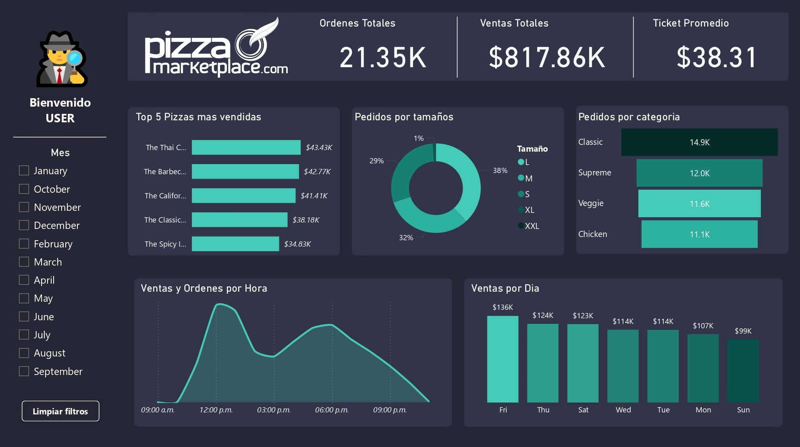
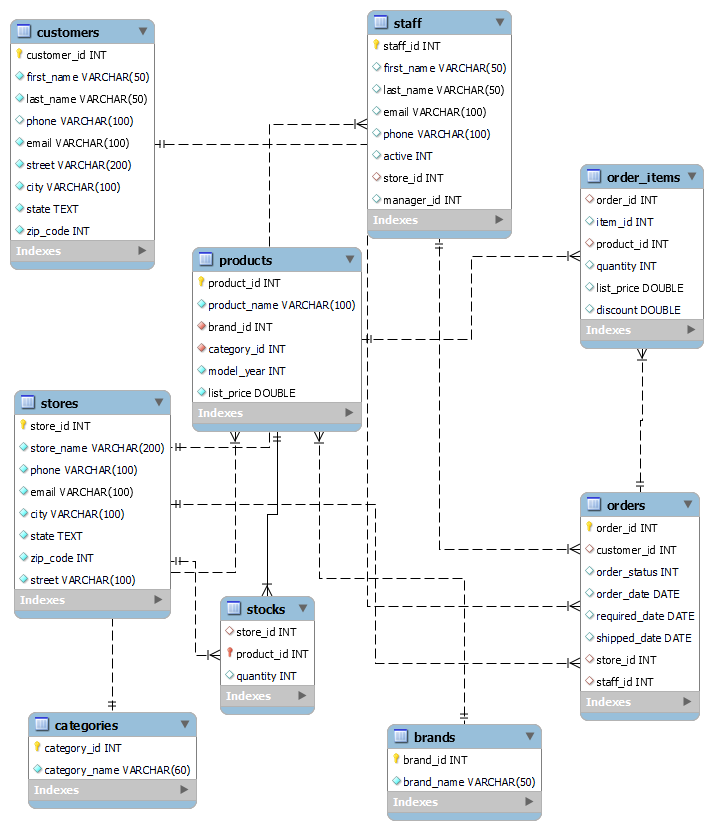
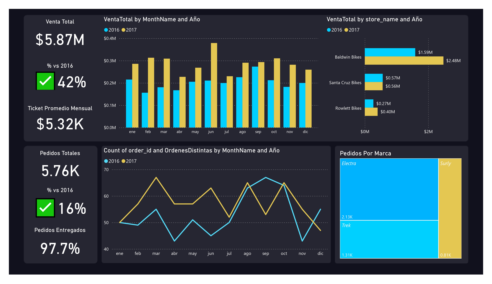

<h1 align="left">Portafolio de Proyectos</h1>

###

<h2 align="left">Mi nombre es Sebastián, conoce los proyectos que he desarrollado en SQL, Python, Power Bi y Excel:</h2>

###

<h2 align="left">🍕 SQL & PowerBi - Pizza Dataset</h2>

###

SQL 📄 ---------------------------------------- Creación de base de datos en MySQL Importación de datos en MySQL Modelado de datos en MySQL Exploración y normalización de datos en MySQL   Power Bi 📊 ---------------------------------------- Limpieza de datos con PowerQuery Armados de KPI mediante DAX Creación de Dashboard

###

###

<h2 align="left">🚲 SQL & PowerBi - BikeStore Dataset</h2>

###

SQL 📄 ---------------------------------------- Creación de base de datos en MySQL Importación de datos en MySQL Modelado de datos en MySQL Exploración y normalización de datos en MySQL

###

###

Power Bi 📊 ---------------------------------------- Limpieza de datos con PowerQuery Armados de KPI mediante DAX Creación de Dashboard

###

###

<!---
sebastiansm2/sebastiansm2 is a ✨ special ✨ repository because its `README.md` (this file) appears on your GitHub profile.
You can click the Preview link to take a look at your changes.
--->
